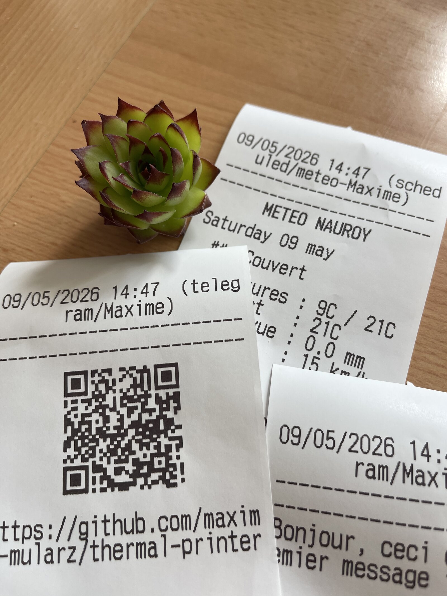
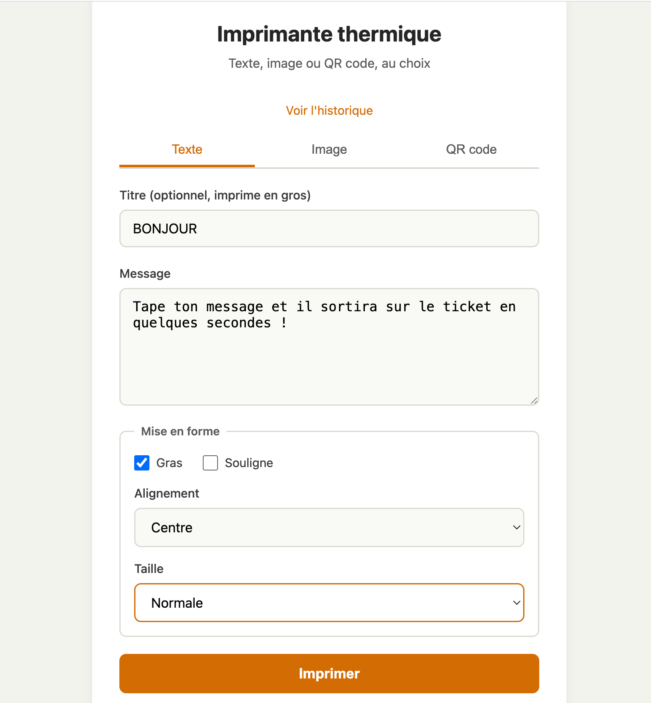

# 🖨️ thermal-printer

> Turn any USB thermal receipt printer into a personal "Polaroid for messages" — print from Telegram, a web UI, or a REST API.

<p align="center">
  
</p>

<p align="center">
  <a href="LICENSE"></a>
  
  
  
</p>

## What is this?

A self-hosted service that runs on a Raspberry Pi and lets you print messages on a thermal receipt printer from anywhere — your phone (via Telegram), your browser (web UI), or your own apps (REST API). It supports rich text, photos, QR codes, and even prints the daily weather forecast every morning.

Think of it as a tangible notification system: instead of yet another phone notification, you get a real paper ticket. Useful for to-do reminders, photo souvenirs, kids' messages, kitchen recipes, IoT alerts, or just for the joy of it.

## ✨ Features

- 📱 **Telegram bot** — send a text or photo to your bot, it prints
- 🌐 **Web interface** — clean form accessible from any browser on your network
- 🔌 **REST API** — token-protected endpoints for your own automations
- 🖼️ **Image printing** — automatic black & white conversion with Floyd-Steinberg dithering
- 📲 **QR codes** — generate and print on the fly from text or URLs
- 🌤️ **Daily weather** — automated morning weather report (uses free Open-Meteo API, no key required)
- 📚 **History** — every print is logged in SQLite, browsable via web or `/history` Telegram command
- 🛡️ **Rate limiting** — per-source hourly/daily quotas to prevent runaway scripts
- 🔐 **Access control** — Telegram allowlist + Bearer token for API
- ⚙️ **Auto-start** — runs as a systemd service, restarts on failure

## 🖼️ Screenshots

<table>
  <tr>
    <td align="center"><b>Web interface</b></td>
    <td align="center"><b>Telegram bot</b></td>
  </tr>
  <tr>
    <td></td>
    <td></td>
  </tr>
</table>

## 🛠️ Hardware

### Tested printers

- ✅ **MUNBYN P047** (USB, 80mm) — recommended
- ✅ **Epson TM-m30-II** (USB, 80mm)
- ✅ **Epson TM-T20III** (USB, 58/80mm)
- ✅ Generic POS-5890K / ZJ-5890K clones (USB, 58mm) — found under many brands on AliExpress

### Should work with

Any USB thermal printer that speaks the **ESC/POS** protocol. The `python-escpos` library has profiles for hundreds of models. Bluetooth printers may work but are not recommended (less reliable, harder to set up).

### Other requirements

- **Raspberry Pi** (3, 4, 5, or Zero 2 W tested)
- **Thermal paper rolls** matching your printer's width (usually 58mm or 80mm)
- USB cable & power supply for the printer
- Network connection (Wi-Fi or Ethernet)

## 🚀 Quickstart

### 1. Clone and install

```bash
git clone https://github.com/maxime-mularz/thermal-printer.git
cd thermal-printer
python3 -m venv venv
source venv/bin/activate
pip install -r requirements.txt
```

### 2. Configure your printer

```bash
# Find your printer's USB IDs
lsusb
# Example output:
# Bus 001 Device 004: ID 04b8:0e20 Seiko Epson Corp.
#                       ^^^^ ^^^^
#                     vendor product
```

Copy the example config and edit it:

```bash
cp .env.example .env
nano .env
```

Set at least:

```
PRINTER_VENDOR_ID=0x04b8
PRINTER_PRODUCT_ID=0x0e20
PRINTER_WIDTH=48                # 32 for 58mm paper, 48 for 80mm
TELEGRAM_BOT_TOKEN=<your-bot-token-from-BotFather>
TELEGRAM_ALLOWED_USER_IDS=<your-telegram-id>
```

### 3. Set USB permissions

So your user can talk to the printer without `sudo`:

```bash
sudo tee /etc/udev/rules.d/99-escpos.rules > /dev/null <<EOF
SUBSYSTEM=="usb", ATTRS{idVendor}=="04b8", ATTRS{idProduct}=="0e20", MODE="0664", GROUP="plugdev"
EOF
sudo usermod -a -G plugdev $USER
sudo udevadm control --reload-rules && sudo udevadm trigger
# Unplug and replug the printer
```

### 4. Stop CUPS (it can hijack the printer)

```bash
sudo systemctl stop cups
sudo systemctl disable cups
```

### 5. Run it

```bash
uvicorn app.main:app --host 0.0.0.0 --port 8000
```

Open `http://<pi-ip>:8000` in your browser, or send a message to your Telegram bot.

## ⚙️ Configuration

All settings live in `.env`. Full reference:

| Variable | Default | Description |
|---|---|---|
| `PRINTER_TYPE` | `usb` | `usb`, `serial`, `network`, or `dummy` (test mode) |
| `PRINTER_VENDOR_ID` | `0x04b8` | USB vendor ID (hex), find with `lsusb` |
| `PRINTER_PRODUCT_ID` | `0x0e20` | USB product ID (hex) |
| `PRINTER_WIDTH` | `48` | Columns: 32 for 58mm paper, 48 for 80mm |
| `PRINTER_PROFILE` | `TM-T88V` | ESC/POS profile name from `python-escpos` |
| `API_HOST` | `0.0.0.0` | FastAPI bind address |
| `API_PORT` | `8000` | FastAPI port |
| `API_TOKEN` | `change-me` | Bearer token for `/api/*` endpoints |
| `TELEGRAM_BOT_TOKEN` | (empty) | Token from @BotFather. Empty = bot disabled |
| `TELEGRAM_ALLOWED_USER_IDS` | (empty) | Comma-separated user IDs. Empty = anyone can use the bot |
| `RATE_LIMIT_PER_HOUR` | `20` | Max prints per hour per source |
| `RATE_LIMIT_PER_DAY` | `100` | Max prints per day per source |
| `WEATHER_ENABLED` | `true` | Toggle the daily weather job |
| `WEATHER_LATITUDE` | `48.8566` | Latitude for weather lookup |
| `WEATHER_LONGITUDE` | `2.3522` | Longitude for weather lookup |
| `WEATHER_CITY` | `Paris` | City name (display only) |
| `WEATHER_DAILY_HOUR` | `7` | Hour (24h) when daily weather prints |
| `WEATHER_DAILY_MINUTE` | `0` | Minute when daily weather prints |

### Generate a secure API token

```bash
python3 -c "import secrets; print(secrets.token_urlsafe(32))"
```

## 📖 Usage

### Telegram bot

| Command | Action |
|---|---|
| `/start` | Show help |
| *plain text* | Print as a regular message |
| *photo* | Print the photo (with optional caption) |
| `/bold <text>` | Print in bold |
| `/title <title>\|<message>` | Print with a big title |
| `/qr <text or URL>` | Generate and print a QR code |
| `/meteo` | Print the current weather forecast |
| `/history [n]` | Show last `n` prints (default 10, max 50) |

### Web interface

Open `http://<pi-ip>:8000` and use the form. Three tabs: **Text**, **Image**, **QR code**. The history is at `/history`.

### REST API

All endpoints require `Authorization: Bearer <API_TOKEN>` header.

**Print text:**
```bash
curl -X POST http://<pi-ip>:8000/api/print \
  -H "Authorization: Bearer <token>" \
  -H "Content-Type: application/json" \
  -d '{"text":"Hello!", "title":"DEMO", "bold":true, "align":"center"}'
```

**Print an image:**
```bash
curl -X POST http://<pi-ip>:8000/api/print-image \
  -H "Authorization: Bearer <token>" \
  -F "image=@photo.jpg" \
  -F "caption=Vacation 2026"
```

**Print a QR code:**
```bash
curl -X POST http://<pi-ip>:8000/api/print-qr \
  -H "Authorization: Bearer <token>" \
  -H "Content-Type: application/json" \
  -d '{"data":"https://example.com", "title":"VISIT US"}'
```

**Trigger weather print:**
```bash
curl -X POST http://<pi-ip>:8000/api/weather \
  -H "Authorization: Bearer <token>"
```

**Read history:**
```bash
curl http://<pi-ip>:8000/api/history?limit=20
```

## 🏗️ Architecture

```
┌──────────────┐  ┌──────────────┐  ┌──────────────┐
│ Telegram bot │  │   Web UI     │  │  REST API    │
└───────┬──────┘  └──────┬───────┘  └──────┬───────┘
        │                │                  │
        └────────────────┼──────────────────┘
                         │
                ┌────────▼────────┐
                │  FastAPI app    │
                │  + APScheduler  │  ← daily weather
                └────────┬────────┘
                         │
                ┌────────▼────────┐
                │   Print queue   │  ← rate limit + history
                │   (asyncio)     │
                └────────┬────────┘
                         │
                ┌────────▼────────┐
                │  python-escpos  │
                └────────┬────────┘
                         │ USB
                         ▼
                  🖨️ ESC/POS printer
```

A single async worker consumes the queue, so no two print jobs hit the printer simultaneously. New input channels (email, webhooks, etc.) are easy to plug in — they just push `PrintJob` objects to the queue.

## 🔧 Run as a systemd service

To start automatically at boot:

```bash
sudo tee /etc/systemd/system/thermal-printer.service > /dev/null <<EOF
[Unit]
Description=Thermal Printer Service
After=network-online.target
Wants=network-online.target

[Service]
Type=simple
User=$USER
WorkingDirectory=$HOME/thermal-printer
Environment="PATH=$HOME/thermal-printer/venv/bin"
ExecStart=$HOME/thermal-printer/venv/bin/uvicorn app.main:app --host 0.0.0.0 --port 8000
Restart=on-failure
RestartSec=5

[Install]
WantedBy=multi-user.target
EOF

sudo systemctl daemon-reload
sudo systemctl enable thermal-printer
sudo systemctl start thermal-printer
```

Useful commands:
```bash
sudo systemctl status thermal-printer    # is it running?
sudo journalctl -u thermal-printer -f    # follow logs
sudo systemctl restart thermal-printer   # after editing .env
```

## 🧪 Testing without a printer

Set `PRINTER_TYPE=dummy` in your `.env`. The service will accept jobs and log the would-be output instead of sending it to a printer. Useful for development.

## 🐛 Troubleshooting

| Problem | Fix |
|---|---|
| `USBError: Access denied` | udev rule missing, or user not in `plugdev` group. See step 3 of Quickstart. Reboot after adding the user to the group. |
| `USBError: Resource busy` | CUPS is hijacking the printer. `sudo systemctl stop cups && sudo systemctl disable cups` |
| `Image width is too large` | The selected ESC/POS profile has a smaller max width than the image. Either reduce `max_width` in `app/printer.py` or change `PRINTER_PROFILE` to one matching your printer. |
| Garbled characters / weird accents | Try a different `PRINTER_PROFILE` (e.g. `default`, `TM-T88V`, `TM-T20II`). The full list is in `python-escpos`. |
| Telegram bot logs `httpx.ReadError` periodically | Normal noise from long-polling timing out. The bot reconnects automatically. |
| Daily weather not printing | Check timezone in scheduler (set to `Europe/Paris` by default in `app/scheduler.py`). |

## 🗺️ Roadmap / Ideas

Some directions this project could grow in. PRs welcome!

- [ ] Scheduled / delayed prints (`/remind tomorrow 8am`)
- [ ] Email-to-print bridge (IMAP poller)
- [ ] Home Assistant integration examples
- [ ] AI integration (`/ai write a haiku`)
- [ ] Anonymous "guest mode" with public URL (for parties)
- [ ] Templates for common formats (shopping list, recipe, agenda)
- [ ] Printer status / paper-low estimation
- [ ] Docker image

## 🤝 Contributing

Contributions are very welcome. The code is intentionally small and modular:

- New input channel → add a module under `app/channels/` and start it from `app/main.py`'s `lifespan`
- New job type → extend the `PrintJob` dataclass and the `_print_job` switch in `app/printer.py`
- New scheduled task → add a job in `app/scheduler.py`

Please open an issue first for larger changes so we can discuss design.

## 📝 License

[MIT](LICENSE) — do whatever you want with it, just keep the copyright notice.

## 🙏 Acknowledgments

- [python-escpos](https://github.com/python-escpos/python-escpos) — the library doing the actual printer talking
- [python-telegram-bot](https://github.com/python-telegram-bot/python-telegram-bot) — Telegram client
- [FastAPI](https://fastapi.tiangolo.com/) — web framework
- [Open-Meteo](https://open-meteo.com/) — free weather API, no key required, much love
- The Adafruit thermal printer community for blazing the trail years ago

---

<p align="center">
  Made with ❤️ on a Raspberry Pi.<br>
  <i>If this project sparks joy, consider giving it a ⭐</i>
</p>
